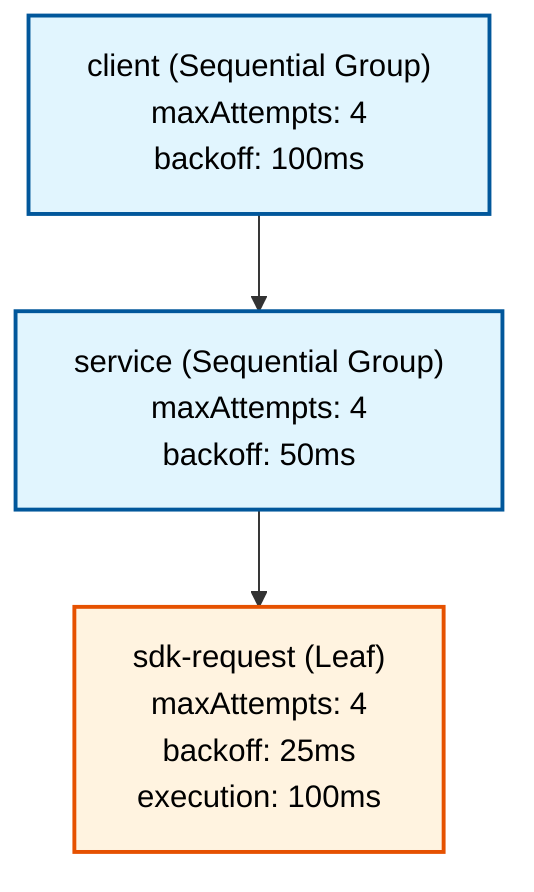
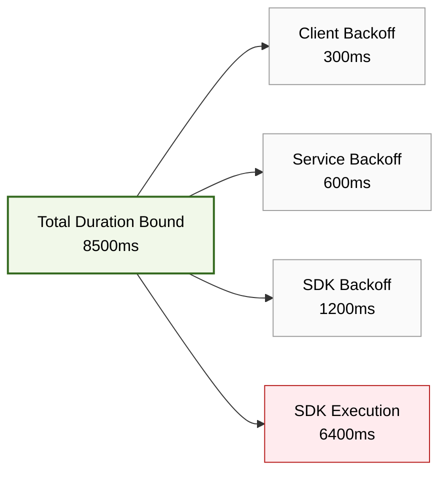

# Retry Budget Validator

A production-quality, open-source TypeScript library and CLI that statically analyze a declared retry topology. 

**Problem:** Deeply nested services and SDKs often configure their own retry loops. When a failure occurs, these nested retries multiply exponentially (e.g., 4 client retries x 4 service retries x 4 SDK retries = 64 requests). This can inadvertently cause severe traffic spikes, exhaust request deadlines, or overwhelm downstream systems. 

**Solution:** This library provides strict static analysis of your retry tree without executing any HTTP requests. Given attempt limits, execution duration bounds, backoff policies, and a request deadline, it computes the exact worst-case exhaustion duration, amplification metrics, and counterfactuals (e.g., "What happens if I disable retries on this one node?").

## Installation

```bash
npm install retry-budget-validator
```

*Requires Node.js >= 22.0.0. The core library supports browser environments with BigInt support.*

## Attempts vs. Retries

In this library, `maxAttempts = A` means **A total attempts**, which includes the initial execution. This means `retries = A - 1`. If `maxAttempts: 4`, the operation will execute at most 4 times (1 initial attempt + 3 retries). Every time a parent operation retries, all children are given a fresh retry budget starting from attempt 1.

## Quickstart (TypeScript)

```typescript
import { analyze, formatText } from "retry-budget-validator";

const model = {
  schemaVersion: 1,
  deadlineMs: 10000,
  root: {
    id: "r",
    kind: "leaf",
    attemptDurationMs: { min: 100, max: 100 },
    retry: { maxAttempts: 4, backoff: { kind: "constant", delayMs: 100, jitter: "none" } }
  }
};

const result = analyze(model);
if (result.kind === "invalid") {
  console.error(result.issues);
} else {
  console.log(formatText(result.report));
}
```

## Quickstart (CLI) & Worked Example

You can analyze a JSON model directly from the command line:

```bash
npx retry-budget analyze examples/nested-retries.json
```

### The "G03" Three-Layer Example
Consider a 3-layer architecture:
- `client` (Sequential Group): 4 attempts, 100ms constant backoff
- `service` (Sequential Group): 4 attempts, 50ms constant backoff
- `sdk-request` (Leaf): 4 attempts, 25ms constant backoff, 100ms execution bound

Even though each layer only configures 4 attempts, the nesting results in **64 leaf requests**!

**Output highlights:**
- **Duration**: 8500ms (worst-case exhaustion)
- **Workload**: 84 total operation attempts, 64 leaf attempts (64x amplification)
- **Timing Decomposition**: Identifies exactly where the 8500ms goes (e.g., SDK execution takes up 6400ms, while the various backoffs consume the rest).
- **Counterfactuals**: Tells you exactly how much time and traffic you would save by disabling retries at each specific layer.

## How it works

### 1. Topology Modeling
Retry Budgets statically evaluate your retry and timing configurations across nested architectures:



### 2. Timing Decomposition
The library performs deep static decomposition to pinpoint critical timing contributors for upper limits:



## Limits & Validation
- Trees up to 1000 nodes and depth 32
- Up to 100,000 total delays across all nodes
- Exact math via BigInt (no floating point precision loss)
- Strict validation rejects unknown fields, object references/cycles, array holes, and unsafe integers.

## Documentation
- [API Reference](./docs/api.md)
- [Semantics & Math](./docs/semantics.md)
- [Limitations](./docs/limitations.md)
- [Recipes](./docs/recipes.md)

## License
MIT
