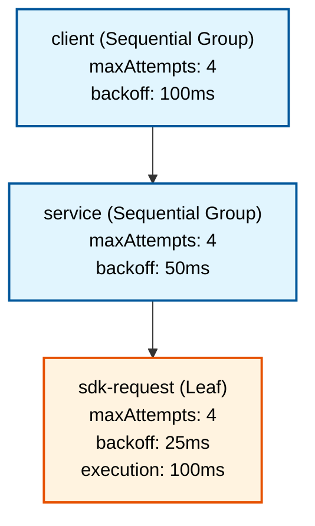
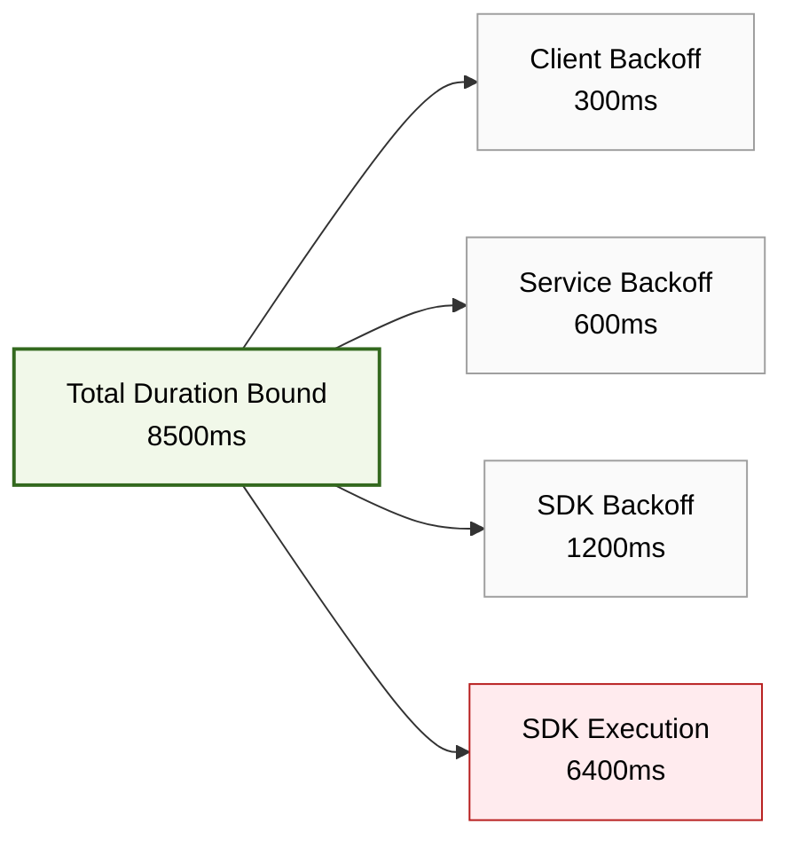

# Retry Budget Validator

A production-quality, open-source TypeScript library and CLI that statically analyze a declared retry topology. 

Given attempt limits, execution duration bounds, backoff policies, and a request deadline, this library explains:
1. How many attempts each operation can receive for one incoming request.
2. How nested retries amplify downstream work.
3. The configured retry exhaustion duration envelope.
4. Whether that envelope exceeds a declared budget.
5. Which operations, backoffs, and retry layers contribute to the result.
6. How a proposed policy change affects demand and duration.

## How it works

### 1. Topology Modeling
Retry Budgets statically evaluate your retry and timing configurations across nested architectures:



*Nested retries lead to exponential request amplification. In the above example, a single failed client invocation can result in 64 total network requests (4 x 4 x 4).*

### 2. Timing Decomposition
The library performs deep static decomposition to pinpoint critical timing contributors for upper limits:



## Installation

```bash
npm install retry-budget-validator
```

## Quickstart (CLI)

```bash
npx retry-budget analyze examples/nested-retries.json
```

## Quickstart (TypeScript)

```typescript
import { analyze, formatText } from "retry-budget-validator";

const model = {
  schemaVersion: 1,
  deadlineMs: 10000,
  root: {
    id: "r",
    kind: "leaf",
    attemptDurationMs: { min: 100, max: 100 },
    retry: { maxAttempts: 4, backoff: { kind: "constant", delayMs: 100, jitter: "none" } }
  }
};

const result = analyze(model);
if (result.kind === "invalid") {
  console.error(result.issues);
} else {
  console.log(formatText(result.report));
}
```

## Limits
- Trees up to 1000 nodes and depth 32
- Up to 100,000 total delays across all nodes
- Exact math via BigInt

## License
MIT
